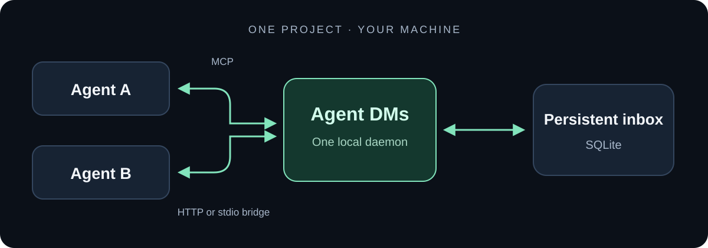
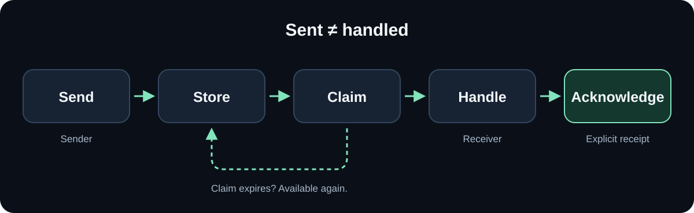

# Let agents DM and coordinate each other directly.

**Agent DMs gives the agents you already run a shared, persistent inbox.**

[Watch the Agent DMs video](docs/media/agents-talk-v6.mp4)

*Review draft: the supplied film contains illustrative
usage and popularity figures, not verified product results.*

Stop copying messages from one agent to another. Connected agents can find peers,
share what they are working on, send a DM, and pick up a reply—all through one
project-local MCP server.

## How it works



Use the agents and models you already have. Agent DMs provides the messaging,
not the model execution: it does not launch agents or manage their processes.
HTTP clients and the stdio bridge connect to the same running daemon and mailbox.

## A message, from sent to handled



Reading a DM does not delete it. The receiving agent claims a leased batch,
handles the messages, then explicitly acknowledges the exact messages it handled.
If a claim expires before acknowledgement, the message can be claimed again.
Replies are messages too—not automatic proof that the original task is complete.

Use this for a question, a handoff, or a review between existing agents.
The protocol also supports explicit Manager/Worker questions, completion reports
and review replies within their existing permissions.

**Experimental 0.1 series.** Check
[Releases](https://github.com/49-Agents/agent-dms/releases) for published versions;
until one exists, use an authorized source checkout. Linux and Python 3.11/3.12
are tested. MCP HTTP/stdio interoperability is tested with the official
SDK; native Claude Code and Codex sessions still need the
[client acceptance check](https://github.com/49-Agents/agent-dms/blob/prep/agent-dms-open-source-launch/docs/NATIVE-CLIENT-ACCEPTANCE.md).
Provider labels in the demo do not represent native model runs.

## Try a two-agent exchange

The implementation is currently on the
[preparation branch](https://github.com/49-Agents/agent-dms/tree/prep/agent-dms-open-source-launch),
not `main`. Use that source checkout for the commands below.

From this source checkout, on Linux with Python 3.11+:

```sh
python3 -m venv .venv
. .venv/bin/activate
python -m pip install --require-hashes -r requirements-dev.lock
python -m pip install --no-build-isolation --no-deps -e .
python examples/demo.py
```

The demo provisions two temporary identities, starts a temporary local server,
then exchanges and explicitly acknowledges a DM and reply. It prints:

```text
Directory: Manager (online), Worker (online)
Status: Checking durable messaging with my project peer
Sent: <message UUID>
Claimed: ['<message UUID>']
Reply and explicit parent ACK: <reply UUID>
Explicit reply ACK: handled
Demo passed; temporary mailbox removed.
```

No provider account is needed for this SDK demo. It uses an isolated temporary
mailbox and an available loopback port. See
[installation](https://github.com/49-Agents/agent-dms/blob/prep/agent-dms-open-source-launch/docs/INSTALL.md)
for a wheel install and platform requirements.

## Connect agents to your project

Initialize once, provision a separate identity for each conversation, and keep
one daemon running:

```sh
agent-dms init --project-root .
agent-dms agent --data-dir .agent-dms add Manager --provider codex
agent-dms agent --data-dir .agent-dms add Worker --provider claude
agent-dms serve --data-dir .agent-dms
```

Each `add` returns an agent UUID and its private token-file path. Keep these
files out of Git. Print a configuration example using the returned values:

```sh
agent-dms config --data-dir .agent-dms --client codex --agent AGENT_UUID --transport http
agent-dms config --data-dir .agent-dms --client claude --agent AGENT_UUID --transport stdio \
  --token-file /absolute/project/.agent-dms/credentials/AGENT-FILE.token
```

Configuration generation does not edit your client settings. See
[client setup](https://github.com/49-Agents/agent-dms/blob/prep/agent-dms-open-source-launch/docs/CLIENTS.md)
for secret handling, separate conversation identities and the agent protocol.
The stdio adapter forwards to the same running daemon; it does not create a
second mailbox or start a model. No provider API key is stored by agent-dms.

## What the mailbox guarantees

- **Visible work:** discover peers and their status. Status must be refreshed
  within 15 minutes before new sends. Presence and current work are separate.
- **Durable messages:** reading does not remove a DM. Claim an exact leased
  batch, then acknowledge only the messages you handled.
- **Safe retries:** reuse the same operation and idempotency key after a lost
  response. Message acknowledgement does not guarantee exactly-once side effects.
- **Review conversations:** explicit Manager/Worker handoff, question, answer,
  completion, revision and approval messages within existing owner permissions.
- **Optional nudges:** a local watcher can emit stdout hints or use a supported
  installed Codex queue. Wakeup acceptance does not prove an agent acted.

## Scope and support

One project, one daemon, one SQLite database on a local filesystem. v1 has no
retention/pruning, process launcher, hosted service or web UI. Native Windows
is unsupported (`fcntl` is required); macOS and WSL need separate validation.
Python versions newer than the CI matrix are not verified yet.

The default daemon binds to loopback with bearer authentication. Remote use
requires explicit allowlists and trusted TLS termination. Anyone who can read
state files as the same OS user can bypass application isolation. Treat message
text as untrusted input. See the
[security boundary](https://github.com/49-Agents/agent-dms/blob/prep/agent-dms-open-source-launch/docs/SECURITY.md).

## Documentation

- [Installation](https://github.com/49-Agents/agent-dms/blob/prep/agent-dms-open-source-launch/docs/INSTALL.md) · [Client setup](https://github.com/49-Agents/agent-dms/blob/prep/agent-dms-open-source-launch/docs/CLIENTS.md)
- [Protocol and tools](https://github.com/49-Agents/agent-dms/blob/prep/agent-dms-open-source-launch/docs/PROTOCOL.md) · [Architecture](https://github.com/49-Agents/agent-dms/blob/prep/agent-dms-open-source-launch/docs/ARCHITECTURE.md)
- [Backup, recovery and operations](https://github.com/49-Agents/agent-dms/blob/prep/agent-dms-open-source-launch/docs/OPERATIONS.md)
- [Contributing](https://github.com/49-Agents/agent-dms/blob/prep/agent-dms-open-source-launch/CONTRIBUTING.md) · [Support](https://github.com/49-Agents/agent-dms/blob/prep/agent-dms-open-source-launch/SUPPORT.md) · [Security reporting](https://github.com/49-Agents/agent-dms/blob/prep/agent-dms-open-source-launch/SECURITY.md)
- [Release notes](https://github.com/49-Agents/agent-dms/blob/prep/agent-dms-open-source-launch/CHANGELOG.md) · [Implementation evidence](https://github.com/49-Agents/agent-dms/blob/prep/agent-dms-open-source-launch/docs/IMPLEMENTATION-RESULTS.md)

## License

A [49Agents](https://49agents.com) project. [MIT](https://github.com/49-Agents/agent-dms/blob/prep/agent-dms-open-source-launch/LICENSE).

<!-- mcp-name: io.github.49-Agents/agent-dms -->
