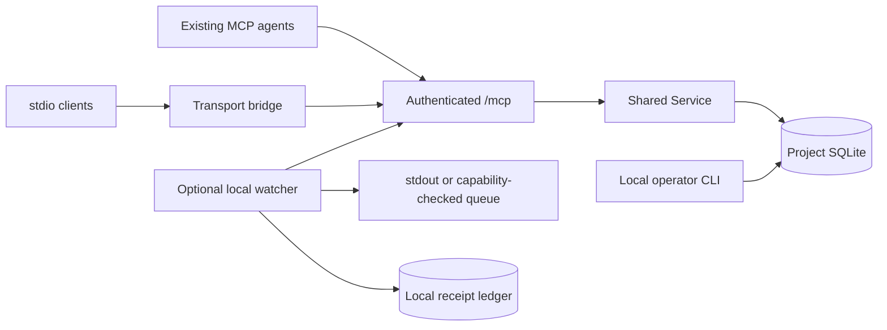
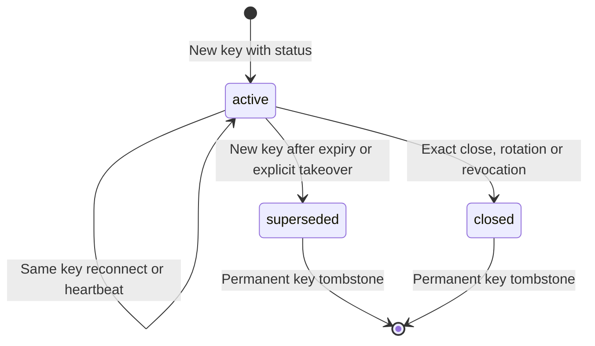
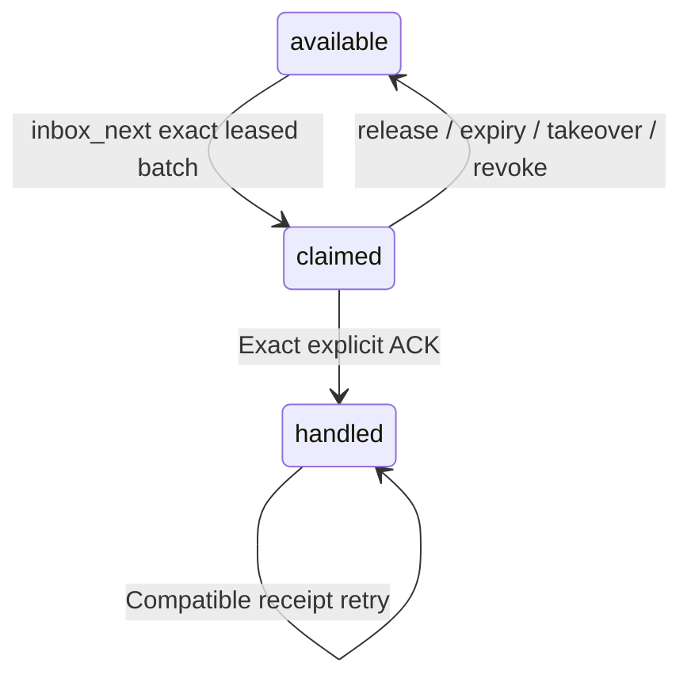
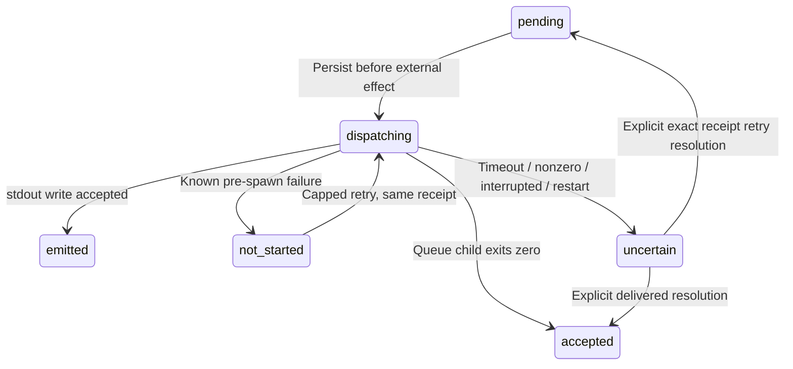

# Architecture

A Python 3.11+ package connects independently running MCP clients to one
project-local daemon. It never launches agents/models or owns terminals. Each
project has one local SQLite database and one daemon, protected by a process
lock. HTTP and the transport-only stdio bridge share the same application rules.

| Module | Actual responsibility |
|---|---|
| config / models / errors | Pydantic project config, private filesystem writes, deterministic validation, clock/UUID helpers and safe domain errors |
| storage / migrations | Schema 1, local WAL/FULL, FK enforcement, 5-second busy timeout, explicit transactions, process lock |
| identity / sessions / status | Digest credentials, operator lifecycle, current generation, status revisions and directory observations |
| messaging / inbox | Immutable DMs, signed stable paging, claims/membership, exact receipts and recovery |
| workstreams | Fixed role/state table, transactional full DMs and append-only events |
| service | Shared operations, authority-before-replay, atomic idempotency and bounded waits |
| mcp_server | Official SDK low-level Server callbacks, stateless Streamable HTTP manager, boundary validation and M01 cancellation integration |
| client / stdio_bridge | Official SDK client using its HTTP transport dependency; proxy tools/prompts/resources without a second store |
| watch / notification_receipts | Optional local stdout/queue wakeups and independent private receipt ledger |
| operations / cli | Online backup/new-directory restore, examples, doctor and console entry point |

Credentials authenticate every HTTP method and every callback; transport session
IDs confer no authority. A supplied application session must be the authenticated
agent's current generation. Directory visibility is project-wide for active
credentials, while history/workstreams are two-participant only. Operators and
same-OS-user processes able to read state can bypass application authorization.
Message bodies remain untrusted opaque data; no execution/URL/file attachment
surface exists.

Every domain operation opens a short connection/BEGIN IMMEDIATE transaction.
Sends commit message/delivery/revision/idempotency together. Workstream mutations
also commit event/state; optional reply/transition ACK belongs to that same
transaction. Full-batch validation precedes ACK writes. No transaction awaits a
network call, long poll or child. Claims recover lazily; history is never pruned.
Clock and identity factories are injected for deterministic checks.

Notification revisions are hints, independent of delivery authority. All pending
pages contribute to counts. Only captured revision is accepted after dispatch;
new arrivals remain observable. Uncertain receipts block subsequent wakeups for
the target until explicit reconciliation. No empty-poll receipt/log history.

The SDK's stateless HTTP dispatcher is per-request, so native cancellation POSTs
cannot reach earlier requests by themselves. Manager amendment M01 permits a
bounded principal/project/exact-typed-ID registry for active validated inbox_wait
handlers. It cancels that local task and preserves official SDK validation,
dispatch and responses. Registry cleanup is identity-guarded in finally; HTTP
disconnect also cancels the request task. IDs are not guessed across principals,
and concurrent same-principal collisions fail retryably. Pre-registration races
may miss cancellation, bounded by the original 25-second deadline. No durable
cancellation state or invented transport session is introduced.
