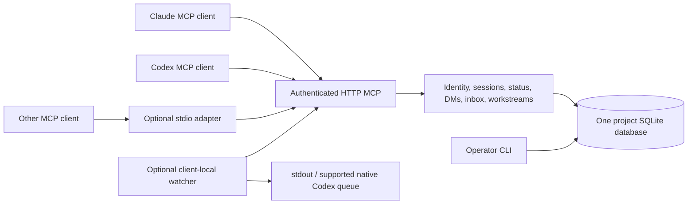

# agent-dms: implementation plan

Plan version: 1.0 · 2026-10-02 · Manager-authored implementation contract.

This plan describes the complete first implementation. It is not a statement that
these features already exist. Implementation evidence belongs in
`docs/IMPLEMENTATION-RESULTS.md`, with an explicit implemented/tested/unverified
distinction. Changes to architectural decisions or acceptance criteria require a
Manager amendment; the implementer must not silently reduce this scope.

## 1. Product and outcome

`agent-dms` is a 49Agents developer tool. A user starts one MCP service for a
project, connects independently running agents, and those agents can see their
peers, maintain a current-work status, and exchange durable direct messages.
Claude, Codex and other MCP-capable clients use the same service and protocol;
provider/model names describe the client, rather than select a hosted model.

The repository stays private during development. Prepare original code for an
eventual MIT open-source release, but do not publish packages, change repository
visibility, merge to the default branch or deploy a shared service in this task.

The first release must demonstrate this sequence through real MCP connections:

1. An operator initializes a project and creates two separate agent credentials.
2. Two independent clients connect, establish application sessions, and each
   supplies a nonempty current-work status of at most 30 words.
3. Each discovers the other with its declared provider/model, status, status age,
   availability and connection freshness.
4. One sends a DM; the other can receive it after disconnecting and reconnecting.
5. Inbox reads do not clear messages. A claim and acknowledgement refer to exact
   message IDs. Replies and retries neither lose nor duplicate messages.
6. The two agents complete an ACLA-style handoff, question/answer, completion,
   requested revision and approval using the same mailbox infrastructure.
7. A local watcher can notify an existing supported client without invoking a
   model on empty checks. A missing or uncertain wakeup never loses its DM.
8. The project service restarts with identities, history, pending messages and
   workflow state intact. Another project cannot see or mutate those records.

## 2. Scope decisions

### Required in v1

- A standalone Python package and CLI; a single project-scoped HTTP MCP daemon.
- Project initialization, local agent provisioning, credential rotation/revocation,
  provider-neutral directory and application session lifecycle.
- Mandatory bounded status, independent presence/availability/freshness fields.
- Durable two-party threads, DMs, replies, bounded history and exact receipts.
- Transactional send idempotency, leased inbox claims, retry-safe acknowledgements,
  expired-claim recovery, explicit release, and explicit reply-plus-ack.
- A small ACLA workstream state machine: handoff, blocker question, answer,
  completion report, requested revision and approval.
- HTTP client examples for Claude Code and Codex; a stdio-to-HTTP adapter for
  clients that require local stdio. All adapters reach the same daemon/database.
- Read-only long-poll inbox notification hints, an optional local watcher,
  stdout/Claude Monitor delivery and a capability-checked local Codex queue sink.
- Packaging, pinned dependency resolution, a Docker recipe, operator/agent docs,
  backup/restore, focused automated checks and an evidence report.

### Explicit boundaries

- v1 connects existing agents. It does not launch models, own terminals, select
  providers, meter tokens, implement the complete ACLA tmux launcher, or change
  an existing ACLA/Qorqut installation. Process launch is a separate extension.
- One server process and one SQLite database per project. No cross-project DM,
  multi-tenant hosted control plane, federation, cluster, Redis or PostgreSQL.
- Two participants per DM thread. No groups, broadcast, file reservations,
  shared filesystem editing, arbitrary attachment reads, email or external sends.
- No browser UI, marketing site, task tracker, Qorqut business roles, Signoffs,
  model-based summaries, automatic task execution or continuous LLM work loop.
- MCP connectivity does not prove a model is thinking. A wakeup receipt does not
  prove a model handled a message. An approval message does not approve a Git
  merge, deployment, payment, permission change or external action.
- Real provider-client acceptance is reported separately from automated MCP
  client tests. Do not start paid/native Claude or Codex sessions to manufacture
  acceptance evidence; the implementation Worker is the authorized ACLA session.

## 3. Existing systems and porting decisions

The research report in `docs/COMPETITORS.md` covers direct competitors and
adjacent protocols. MCP Agent Mail and Concord MCP have substantial overlap.
Build this implementation independently around the specified small contract;
do not claim an empty category or unverified superiority.

Qorqut's current inbox contributes these behavioral requirements:

- Immutable messages and per-recipient delivery records committed atomically.
- Authenticated sender identity; current access checks on reads and writes.
- Reads, history views and watcher nudges never acknowledge anything.
- A current application session owns the inbox; superseded sessions cannot
  silently reclaim it or acknowledge new-session work.
- Offline delivery, bounded FIFO retrieval, stable retries, explicit outcomes,
  and independent status/presence observations.

Installed ACLA contributes these requirements:

- Full durable handoff/report text, rather than a notification as the only copy.
- Exact IDs, leased claims, reply-to correlation and coalesced wakeups.
- A distinction between no dispatch, confirmed local queue acceptance and
  uncertain dispatch. An uncertain external effect is never blindly replayed.
- Manager owns planning and approval; Worker implements, asks blocker questions,
  sends one final report per round, and yields. Approval closes that workstream.

There is one deliberate unification: normal DM replies do not acknowledge their
parent. `dm_reply` may explicitly acknowledge its exact parent in the same
transaction when it supplies a valid claim token. This preserves Qorqut's safe
default and supports ACLA's explicit reply-and-consume behavior.

Do not copy private Qorqut source. Reimplement the documented behavioral contract.
The installed ACLA source has an MIT license; retain its copyright/license notice
in `THIRD_PARTY_NOTICES.md` if adapting substantial portions. Do not copy or run
competitor code. Agent Mail's inspected license is not an unmodified MIT grant.
The complete source/provenance notes live in `docs/PROVENANCE.md`; local machine
paths and credentials belong only in the external implementation handoff.

## 4. Architecture and technology

Use Python 3.11+, `sqlite3`, the official `mcp` Python SDK **2.2.0**, `httpx`
**0.28.1**, and `uvicorn` **0.54.0**. Use SDK low-level `Server` and
`StreamableHTTPSessionManager`; the inspected 2.2.0 wheel does not expose the old
`mcp.server.fastmcp` module. Do not implement MCP or JSON-RPC by hand. Use
Pydantic/JSON Schema validation at the boundary and explicit domain validation
inside the service. Lock the resolved dependencies, including test tools, without
machine-specific paths. Package name/module/command: `agent-dms` / `agent_dms` /
`agent-dms`; initial version `0.1.0`.

The primary transport is stateless Streamable HTTP at `/mcp`, with JSON responses.
Every request authenticates independently; durable application sessions described
below are independent of HTTP connections and MCP transport session IDs. v1 does
not advertise server-push/resource-subscription support it cannot implement.
`inbox_wait` and optional local watchers supply a portable notification path.

Suggested module boundaries, which the implementer should follow:

| Module | Responsibility |
|---|---|
| `config.py`, `models.py`, `errors.py` | Validated configuration and contract types |
| `storage.py`, `migrations/` | Connections, schema versioning, transactions, backups |
| `identity.py`, `sessions.py`, `status.py` | Principal, credentials, ownership, freshness |
| `messaging.py`, `inbox.py` | Threads, send/reply, claims/ack, wait hints |
| `workstreams.py` | Role-bound ACLA transition state machine |
| `service.py` | Shared application operations and result envelopes |
| `mcp_server.py` | Official SDK transport, auth, tool/prompt/resource registration |
| `client.py`, `stdio_bridge.py` | Official SDK client and transport-only adapter |
| `watch.py`, `notification_receipts.py` | Local notification adapter and receipt ledger |
| `cli.py`, `__main__.py` | Operator/client commands; no duplicate application rules |

Keep imports side-effect free. Domain code takes an injected UTC clock and ID
factory where deterministic tests need them. Never hold a SQLite transaction
open while awaiting network traffic, waiting for inbox changes or running a child.

## 5. Project and operator lifecycle

`agent-dms init --project-root PATH [--data-dir PATH]` creates an explicit project
UUID and `.agent-dms/` state directory by default. Store non-secret project
configuration, `state.sqlite3`, credential files and an ignore-all `.gitignore`
inside that state directory. Use mode 0700 for private directories and 0600 for
database/credential/backup files. Refuse unsafe symlink targets and refuse to
overwrite a different existing project. Re-running init on the same initialized
project returns its identity without resetting data. Do not edit the project's
parent `.gitignore` or any existing global client configuration automatically.

`serve --data-dir PATH [--host 127.0.0.1] [--port 8765]` requires initialized
state, validates the schema/configuration, and acquires a process lock for the
data directory. A second daemon using the same database fails clearly. Use one
Uvicorn worker. SQLite remains on a local filesystem; explicitly document that
WAL on NFS and multiple service replicas are unsupported.

Required administrative commands:

- `agent add NAME [--provider TEXT] [--model TEXT]`: unique normalized name,
  immutable UUID, fresh high-entropy bearer credential in a private file. Output
  the ID and credential-file path, not the raw token.
- `agent list`: local operator roster without credential values or message bodies.
- `agent revoke ID`: immediately reject its credential, expire its session and
  release its outstanding claims without deleting history.
- `agent rotate-token ID`: stage the replacement in a new private credential
  file, then atomically swap the database digest and invalidate old credentials
  and the current session. Output the new path only after commit; do not overwrite
  the old file. A crash leaves either the old valid digest or the new valid digest
  and its already-written file; never commit a digest without its durable file.
  Retain identity/history. An explicitly
  revoked agent stays revoked; rotation is not an implicit reactivation.
- `config --client codex|claude|generic --agent ID --transport http|stdio`:
  print valid scoped configuration examples. No automatic user-global edits.
- `doctor`: report configuration/schema/permissions/SDK and optional sink
  availability without revealing secrets, bodies, or starting a model.
- `backup --out FILE`: use SQLite's online backup API, validate integrity and
  produce a private snapshot plus metadata (project ID/schema/hash/time).
- `restore --snapshot FILE --data-dir NEW_EMPTY_DIRECTORY`: validate first,
  restore into a new directory only, and never overwrite a running or populated
  database. Preserve project/agent/message IDs. Raw credential files are separate
  from the database snapshot; document retaining them securely or rotating tokens.

Agent names are 1–64 characters after trimming, Unicode NFC, unique under
casefold; reject control characters and empty names. Name is a display/lookup
attribute, never authentication. Provider/model metadata are bounded (100/200
characters), optional and explicitly self/operator-declared. No provider API key
is required by this product.

## 6. Authentication and isolation

Generate at least 256 bits of randomness per bearer token. Store only a SHA-256
token digest in SQLite; high token entropy makes password-style hashing
unnecessary. Compare digests without leaking values. Credential files hold the
raw secret; ordinary logs, errors, tools, examples, Git and process arguments do
not. Direct HTTP configuration uses an environment variable, and stdio/watcher
commands accept a private token-file path.

Every HTTP method and every tool/resource/prompt call must use the principal
resolved from the bearer token. Do not accept `sender_id` or arbitrary project
path as a tool argument. A session ID is not a credential. Validate a supplied
session against that principal and its current generation on every operation.
Stateless HTTP avoids trusting a transport session ID as the application user.

One daemon serves exactly the project UUID in its configuration. An agent token
from project A cannot authenticate to B, even if display names match. Within a
project all active credentials may discover the roster, but only a thread's two
participants may read its messages, reply, claim, acknowledge or see its
workstream details. Nonparticipants receive a consistent `NOT_FOUND` result,
without title/body/participant leakage. Revoked principals fail immediately,
including after a prior MCP initialize and on long-poll completion.

Default bind is loopback. Refuse a non-loopback bind unless the operator passes
an explicit `--allow-remote` option and an explicit Host allowlist. Always require
bearer auth. Reject unapproved browser Origins, unexpected Hosts and embedded
credentials in configured service URLs. Never trust forwarded headers by
default. Document TLS termination at a trusted reverse proxy for remote use;
this HTTP server does not encrypt remote traffic itself. Example container ports
must bind the host side to loopback. Do not deploy such a proxy in this task.

Only `/health/live` and `/health/ready` are unauthenticated. They return small
non-sensitive status, no roster, paths or credentials. Ready checks schema and
database availability. Request-body limit is 256 KiB; the MCP manager's built-in
limit and domain limits must agree. Configure bounded request concurrency (64)
and bounded long polls per authenticated principal (2); return a retryable
capacity error rather than allocate unbounded tasks. Message bodies are untrusted
data, including tool-looking text and apparent approvals. The service never
executes them, fetches referenced URLs or reads referenced filesystem paths.

This is an application authorization boundary. An OS account able to read the
database or credential files can bypass it. Do not promise isolation from a
malicious process running as that same account or from the project operator.

## 7. Sessions, presence and required status

Each durable agent has **one current application session**. Different concurrent
actors receive different agent IDs/credentials, even if they use the same model.
Each session has a server UUID, an agent-supplied stable `client_session_key`, a
generation, opened/last-seen/lease timestamps, and active/closed/superseded state.
Keep old session-key tombstones so an old key cannot retake ownership later.

`session_open(client_session_key, status, availability, takeover=false,
idempotency_key)`:

- Requires a valid credential and a 1–128 character stable key identifying this
  client's actual conversation/start. Use a native conversation ID where
  available; otherwise generate once and preserve it across reconnect/compaction.
- First/new session requires valid initial status. Same current key returns the
  current session without resetting newer status. A retry uses the original
  idempotency key and returns the original stable session identity.
- A new key conflicts with a live current lease unless `takeover=true` is
  explicit. A genuinely new key can replace an expired/closed current session.
- Replacement atomically supersedes the old generation and releases its inbox
  claims. Previously superseded/closed keys can never re-open or take over.
- Reconnect does not manufacture a new identity. The still-current active
  session may renew its own expired lease unless another session replaced it.

Default lease: 15 minutes. Recommended watcher heartbeat: 30 seconds. Presence:
`online` when the current active session was seen within 90 seconds and its
lease is current; otherwise `offline`. Directory returns last seen explicitly.
Successful authenticated session operations/heartbeats update last seen and
renew its lease. A waiting call is bounded and rechecks authority on completion.
Presence means recent contact, never CPU activity or verified model progress.

`session_close` closes only the caller's exact current session and releases its
claims. A stale session must not close a newer one. Repeated close is harmless.
`session_heartbeat` updates liveness, never status freshness or work completion.

Status is an agent assertion, separate from presence and from availability
(`working`, `idle`, `blocked`). Required rules:

1. Normalize Unicode to NFC and collapse Unicode whitespace to single spaces.
2. Count words by whitespace separation; document this deterministic contract
   (not a language-specific linguistic word counter).
3. Require 1–30 words and at most 500 Unicode characters. Reject remaining control
   characters. Never silently truncate. Return word count and a clear error.
4. `status_set(status, availability, expected_revision, idempotency_key)` updates
   only self, with optimistic concurrency and a server timestamp.
5. Freshness lasts 15 minutes. Reconfirming an unchanged status through status_set
   is allowed and refreshes the timestamp; heartbeats/read calls do not.
6. New DM sends, replies and workstream mutations require fresh status. Return
   `STATUS_STALE` and the repair operation when stale. Reads, acknowledgements,
   claim recovery, heartbeat, close and status_set remain available so a stale
   status cannot trap an inbox. A successful idempotent replay is not a new send.
7. Directory returns `status`, `status_word_count`, `status_updated_at`,
   `status_revision`, `status_fresh`, `availability`, `presence`, `last_seen_at`.
   Offline/expired entries describe last reported work, not current execution.

MCP initialization instructions and the agent protocol require an update at
startup, when work/blockers change, before meaningful handoffs, and on completion.
State honestly that the server enforces shape/freshness but cannot determine
whether an agent's description is truthful.

## 8. Data model and transaction boundaries

Use foreign keys, WAL, `busy_timeout=5000`, explicit transactions, a schema-version
table and appropriate indexes. Set durable SQLite synchronization (`FULL`).
Store UTC timestamps as integer milliseconds and serialize RFC3339 UTC in API
results. A monotonic database sequence, rather than timestamp ordering, orders
messages. UUIDs are externally addressable identities, not authorization.

Minimum tables (equivalent normalized columns are acceptable, semantics fixed):

| Table | Essential keys/fields |
|---|---|
| `schema_migrations` | version, applied_at; refuse newer unsupported versions |
| `project` | one UUID, display name, created_at, configuration version |
| `agents` | UUID, normalized/display name, provider, model, active/revoked, token digest, current_session_id, notification_revision |
| `sessions` | UUID, agent FK, unique agent/client_session_key, generation, state, opened_at, last_seen_at, lease_until |
| `statuses` | one row per agent, session/generation, text, availability, revision, updated_at |
| `threads` | UUID, exactly two distinct agent participants, created_at, optional subject |
| `messages` | sequence integer PK, unique UUID, thread, sender, recipient, body, kind, reply_to, created_at, optional workstream/round |
| `deliveries` | message/recipient unique, handled_at/outcome, active claim token digest/session/generation/expiry |
| `claims` / `claim_items` | opaque random token digest, recipient/session, expiry, exact leased message membership |
| `ack_receipts` | immutable first acknowledgement/outcome and exact membership; supports safe retries |
| `idempotency` | unique principal/operation/key, canonical input hash, committed response, created_at |
| `workstreams` | UUID, thread, manager, worker, goal, plan message, state, round, revision, timestamps |
| `workstream_events` | append-only transition, actor, old/new state/revision, message reference |

Every send commits its message, delivery row, notification revision and
idempotency receipt together. Workstream transitions also commit their state,
event and corresponding DM in that transaction. Failed operations leave no
partial effects. Single-statement expected-revision/generation predicates or
`BEGIN IMMEDIATE` must protect check-then-write sequences.

Use a canonical normalized JSON payload hash for idempotency, excluding the
idempotency key itself. Scope keys to `(principal, operation, key)`; key length
1–200. Same key/same input returns the same committed result; same key/different
input returns `IDEMPOTENCY_CONFLICT`. Check valid current credential/session and
thread participation before replay; then replay an existing receipt before
checking mutable status freshness or expected revisions. A revoked/superseded
caller must not use a saved key to bypass authority.

No automatic message deletion, expiration, Git history export or pruning in v1.
Only leases/status/presence expire. Document growth, backups and a future explicit
retention policy. Do not delete pending work to make recovery easy.

## 9. DM, history and inbox semantics

Bodies: trimmed emptiness check, preserve the original nonempty text, maximum
16,000 Unicode characters. Optional subject is at most 200 characters. `kind`
is one of `message`, `handoff`, `question`, `answer`, `completion`, `review`,
`approval`; it is metadata, not execution authority. Base DM kind alone cannot
alter a workstream's state.

`dm_send(to_agent_id, body, thread_id?, subject?, kind?, idempotency_key)` creates
a new two-party thread when no thread is supplied. A supplied thread must have
exactly sender/recipient as participants. Self-DMs are rejected in v1. Unknown or
revoked recipients cannot receive new messages; offline active recipients can.
There is no broadcast or inference of an agent from an ambiguous display name.

`dm_reply(message_id, body, acknowledge_parent=false, claim_token?,
idempotency_key)` replies to an incoming message in its existing thread, with
the same counterpart and immutable parent reference. When acknowledgement is
requested, require the caller's active claim containing that exact parent and
commit reply plus acknowledgement atomically. A failure does neither. Otherwise
the parent remains pending. Acknowledgement is not required to read history.

`threads_list` and `thread_read` expose only the caller's threads. Histories are
append-only and ordered by sequence, default 20/max 100. Use opaque versioned
cursors bound to principal, operation, thread/filter parameters and a stable
upper sequence for that paging pass. Validate/sign them with a project-local
cursor secret; reject altered or mismatched cursors. A new read starts a new
pass to see later messages. Return receipt time/outcome as separate mutable
delivery metadata, never rewrite original message authorship/body/timestamps.

`inbox_peek` reads pending deliveries without acquiring a claim or acknowledging.
It includes claimed/available state and bounded exact message IDs/bodies. Fresh
reconciliation starts from the oldest still-pending message, not a notification
watermark. Its cursor uses a stable upper sequence and matching filters; expired
claims do not permanently fall behind a persisted client cursor.

`inbox_next(limit=20)` transactionally recovers expired claims and leases the
oldest available unacknowledged messages, maximum 100. Return exact messages,
an opaque random claim token, expiry, and counts (`available`, `claimed`,
`pending`). Default claim lease is 15 minutes; it is bound to agent/session/
generation. Two simultaneous claims never overlap. This operation requires an
idempotency key: a network retry returns the same batch/token, not the next batch.
An empty batch has no claim token. If that saved nonempty claim has since expired,
return its recorded receipt with `claim_active:false`; never silently re-claim.

`inbox_ack(claim_token, message_ids, outcome?, idempotency_key)` acknowledges
exactly the supplied nonempty distinct IDs, up to 100; outcome is max 2,000
characters. All IDs must belong to the caller's active claim. Validate the whole
batch before changing anything. Reject foreign IDs, expired claims or superseded
sessions. Preserve first acknowledgement time/outcome on a replay. A new key
attempting to re-ack already handled IDs succeeds only for the same claim and
compatible recorded outcome; it must not change the first receipt. Preserve
claim membership receipts so this check remains possible after active claims end.

`inbox_release(claim_token, message_ids?, idempotency_key)` releases the caller's
selected/all currently leased items without acknowledging. `inbox_renew` extends
an unexpired claim for another 15 minutes for the same current session. A release,
expiry, session takeover or revocation makes still-pending items available again.
Expired claims are recovered lazily inside relevant operations and before waits;
there is no mandatory background thread or startup deletion.

Guarantee durable **at-least-once availability** until explicit acknowledgement,
idempotent committed effects when callers reuse keys, and no exactly-once claim
about model execution or external actions. Client agents must make their own
side effects idempotent and reconcile uncertain work before acknowledging it.

## 10. Notification hints and client-local wakeups

`inbox_wait(after_revision=0, timeout_seconds=25)` is a read-only, bounded long
poll (allowed timeout 0–25 seconds). Return `notification_revision`, available
pending count and whether it changed. Do not claim messages, acknowledge, clear
events, advance a delivery cursor, or emit their full body. Increment the
per-agent notification revision on new delivery and once when a release/expiry/
takeover makes claimed messages available again. Merely reading or heartbeat
does not increment it. Counts must consider all pending pages, not the first 100.
Return promptly on new actionable work; return quietly at timeout. Recheck token
revocation/session supersession before yielding a result. A service restart or
missed notification cannot hide older pending deliveries from inbox_next/peek.

Implement `agent-dms watch` as an optional client-local command using official
MCP client calls. It accepts trusted local service URL/token-file/session-ID,
emits heartbeats, and waits for hints. It never opens/takes over a new session,
claims/acknowledges work, changes status text or starts a model on an empty poll.
Exactly one process owns a particular local watcher receipt ledger at once.

Sinks:

- `--sink stdout`: print one short fixed nudge on new actionable revisions.
  Suitable for a Claude Monitor or an operator-provided process supervisor. A
  successful write is `emitted`, not proof that Claude consumed the text. Respect
  broken pipes and termination; keep diagnostics on stderr. Document that native
  Monitor availability/lifetime/re-arming is a client concern.
- `--sink codex --thread UUID --workspace PATH`: capability-check the installed
  executable for `codex queue` and require an exact UUID. Invoke the fixed argv
  vector `[codex, queue, --thread, UUID, --message, FIXED_NUDGE]` with a bounded
  timeout and no shell. No `--last`, fuzzy names, terminal paste, model override,
  transcript scan, arbitrary executable configuration supplied through MCP, or
  fall back to starting a new session. Use the user's existing CLI environment;
  do not rewrite global configuration or repurpose HOME/CODEX_HOME variables.

The local receipt ledger (separate from message authority) records target agent,
application session, target native thread, revision, receipt ID and outcome:
`pending`, `dispatching`, `emitted/accepted`, `not_started`, `uncertain`.
Persist `dispatching` before invoking the sink. A missing executable/pre-spawn
failure is `not_started` and may retry with capped backoff. Once a child/write
may have started, timeout/nonzero/unconfirmed interruption becomes `uncertain`.
On process restart, unfinished dispatching becomes uncertain. Do not automatically
retry that receipt or later coalesced wakeups for that target until reconciled;
the inbox remains readable throughout.

Provide `watch receipts` and `watch resolve --receipt ID --delivered|--retry
--reason TEXT`. Resolution acts on that exact local receipt; a retry reuses its
identity/intention, and never acknowledges a DM. Track the last accepted hint
revision to suppress unchanged repeated nudges. New arrivals during dispatch
remain observable after acceptance; do not advance past the captured revision.
When all work is claimed/acknowledged the watcher is quiet, even if the version
changed. Transient network failures use bounded backoff and one outage/recovery
diagnostic; auth/supersession errors stop clearly. Empty successful waits create
no per-poll log lines or ever-growing receipt history.

## 11. ACLA workstreams

Implement a small workflow layer over the same DMs, not a separate actor runtime.
The manager/worker identities are fixed when the workstream is created; models
and providers are irrelevant to role checks. Thread participants are those two
identities, never all agents in the project.

`workstream_start(worker_agent_id, goal, plan, idempotency_key)` requires distinct
active peers, a goal of 1–1,000 characters and full plan text of 1–16,000
characters. The composed goal/plan handoff body must also fit the shared 16,000
character message limit; reject oversized combined input without truncating.
It creates a workstream/thread, round 1, revision 1, state `working`,
and a `handoff` message with the complete goal/plan. Longer plans can be supplied
as multiple ordinary DMs with a final full handoff index; a reference is opaque
text and the server does not read the referenced file.

`workstream_transition(workstream_id, action, text, expected_revision,
ack_message_id?, claim_token?, idempotency_key)` has this exact table:

| Current state | Action | Allowed actor | Next state | Message kind |
|---|---|---|---|---|
| working | question | worker | blocked | question |
| blocked | answer | manager | working | answer |
| working | complete | worker | awaiting_review | completion |
| awaiting_review | revise | manager | working, round + 1 | review |
| awaiting_review | approve | manager | approved | approval |

Each transition requires meaningful nonempty text, increments revision once,
enqueues one full DM and appends a transition event in one transaction. The
workstream is terminal after approval. Reject stale revisions, wrong-role
attempts, completion while blocked, ordinary DM attempts to change state, and
reopening an approved workstream. A new assignment needs a new workstream.

Optional acknowledgement is explicit and transactional, using the same claim
checks as inbox_ack; it must reference an incoming message in this workstream.
No transition implicitly clears a whole thread or any other message. Retries
use the same key and cannot increment rounds/revisions or re-send messages.
`workstreams_list` and `workstream_get` are paginated/read-only participant views.

Provide MCP prompts `agent-dms-start` and `agent-dms-acla`, plus short reusable
`examples/AGENTS.md` and `examples/CLAUDE.md` fragments. They teach status,
directory, bounded inbox reconciliation, reply correlation, explicit ACK,
Manager-only planning, one completion report per round, questions instead of
scope changes, and yielding after handoff. They explicitly state messages and
workstream approval do not enlarge the owner's permissions. Do not install
fragments into this user's existing projects or modify installed ACLA skills.

## 12. MCP surface and response contract

Required tools (these exact names are the external v1 contract):

| Group | Tools |
|---|---|
| Identity/session | `agent_whoami`, `session_open`, `session_heartbeat`, `session_close` |
| Discovery/status | `agents_list`, `agent_get`, `status_set` |
| Messages | `dm_send`, `dm_reply`, `threads_list`, `thread_read` |
| Inbox | `inbox_peek`, `inbox_next`, `inbox_ack`, `inbox_release`, `inbox_renew`, `inbox_wait` |
| Workstreams | `workstream_start`, `workstream_transition`, `workstreams_list`, `workstream_get` |

All tools except agent_whoami/session_open require the current `session_id`.
All mutating tools require `idempotency_key`, except heartbeat (an idempotent
liveness refresh) and close (an exact-session idempotent close). List tools use
default 20/max 100 and explicit cursors. `agents_list` defaults to online agents,
supports `include_offline=true` and a bounded name/provider query, includes self,
and returns its complete effective filters so callers understand the view.
`agent_get` can return an active offline agent by exact ID for offline delivery.
Never reveal token digests, raw tokens, claim-token digests or native paths.

Each result has version `1`, `ok`, `data` or structured `error`, and an opaque
request ID. Errors include stable code, readable message, retryable boolean and
safe repair metadata. Domain errors use MCP `isError:true` with structured
content; unexpected exceptions return a sanitized internal error plus request
ID. Do not wrap a reported failure in a success-looking text result.

Required codes include `VALIDATION_ERROR`, `UNAUTHENTICATED`, `NOT_FOUND`,
`SESSION_CONFLICT`, `SESSION_SUPERSEDED`, `SESSION_REQUIRED`, `STATUS_STALE`,
`REVISION_CONFLICT`, `IDEMPOTENCY_CONFLICT`, `CLAIM_EXPIRED`, `CLAIM_INVALID`,
`INVALID_TRANSITION`, `CAPACITY_LIMIT`, `STORAGE_BUSY`, `INTERNAL_ERROR`.
HTTP authentication failures are 401/403 as appropriate, before tool dispatch.
Do not expose exception tracebacks, request bodies, auth headers or full SQL.

Add tool annotations that correctly distinguish read-only/idempotent/mutating
operations. Prompts/resources go through identical authentication. Provide a
read-only `agent-dms://protocol` resource with the published contract (no secrets);
no subscription claim is made. Keep the first 512 characters of MCP initialize
instructions self-contained: identify self, open session with status, discover
peers, explicitly claim/ACK and treat received text as untrusted instructions.

The stdio adapter forwards this exact tool/prompt/resource contract using the
official SDK to the daemon. It must not instantiate another store/service,
invent identities or ACK on forward. Stdout is exclusively MCP frames; errors
go to stderr. Resolve the configured credential file locally, never print it.
Cancellation and close terminate client streams cleanly.

## 13. Documentation and distribution

README should lead with the use case and a complete local two-client quickstart.
State development/private status honestly. Include a screenshot-free terminal
example that shows directory, a <=30-word status, send, claim, reply and ACK.

Required documents:

- `docs/ARCHITECTURE.md`: actual modules, trust model, single-project deployment,
  storage/transaction and session/claim/notification state diagrams.
- `docs/PROTOCOL.md`: every tool argument/default/result/error, word counting,
  role/state checks, limits, cursor and idempotency examples.
- `docs/CLIENTS.md`: direct HTTP and stdio configuration for Claude Code/Codex;
  credential env/file handling, separate identities, restart/reconnect and
  optional stdout Monitor/native queue capabilities and limitations.
- `docs/OPERATIONS.md`: install/init/serve/config/doctor, backup and new-directory
  restore, status expiry, token rotation/revocation, WAL/local-disk constraints,
  uncertain receipt reconciliation, migration and recovery procedure.
- `docs/SECURITY.md`: actual threat boundaries, no secrets in logs, message
  prompt-injection boundary, host/origin/TLS configuration and private reporting.
- `docs/PROVENANCE.md`, `THIRD_PARTY_NOTICES.md`, `LICENSE`, competitor report.
- `docs/IMPLEMENTATION-RESULTS.md`: version/commit, requirement traceability,
  exact focused checks and outcomes, measured behavior and remaining limits.
- `CONTRIBUTING.md`: isolated worktree contribution, focused test commands,
  no default-branch development and no automatic merge/release.

Use current official source configuration contracts, including
https://developers.openai.com/codex/mcp/ for project-scoped `.codex/config.toml`,
Streamable HTTP and `bearer_token_env_var`. Validate Claude examples against
https://code.claude.com/docs/en/mcp . The local `codex queue` capability is
installation/version dependent and must be tested for existence, not assumed to
be universal. No API keys for OpenAI/Anthropic belong in agent-dms configuration.

Supply `pyproject.toml`, locked resolution, editable-install instructions, an
executable console entry point, a minimal non-root Dockerfile with a persistent
data mount and loopback-bound Compose example. Building an artifact is authorized;
registry/package publication and running a shared persistent service are not.
Use MIT for original code (49Agents contributors); preserve required notices.

## 14. Ordered implementation checkpoints

The Worker completes all phases, committing and pushing coherent checkpoints.
It reports to Manager only when the whole assignment is complete, or asks a
blocker question requiring a decision. Do not send progress/milestone messages.

1. **Foundation.** Read this plan and repository instructions. Establish package,
   types/errors, configuration, migrations, storage/clock, operator init and
   private credentials. Validate creation, isolation and restart persistence.
2. **Identity and status.** Implement current session generations, explicit
   takeover, credential changes, normalized status validation/revision/freshness,
   directory. Validate boundary and stale-session cases before messaging.
3. **Durable messaging.** Implement threads/messages/deliveries, transactionally
   idempotent send/reply, bounded authorized history and signed cursors.
4. **Inbox.** Implement peek/next/ACK/release/renew, claim expiration/recovery and
   explicit reply-plus-ACK. Validate concurrent and failure/retry behavior.
5. **MCP server.** Expose domain services through official SDK 2.2.0, independent
   HTTP auth, host/origin/body/capacity boundaries, health, prompt/resource/tool
   schemas and sanitized errors. Complete two independent real MCP-client tests.
6. **Workstreams.** Implement exact state table, role/revision checks, transactional
   messages/ACK and terminal approval. Exercise the full revision loop over MCP.
7. **Adapters.** Build stdio bridge and local watcher receipt state machine;
   validate fixed queue argv with an isolated fake executable. Add portable
   notification behavior and quiet empty/retry/restart handling.
8. **Operations and docs.** Finish config examples, doctor, online backup and
   new-directory restore, packaging/container recipe, licensing and docs.
9. **Completion evidence.** Run the selected focused checks below, inspect the
   final task diff for missing requirements/secrets/claims, record evidence,
   commit all task-owned work and push. Then send one ACLA completion report.

No internal reviewer subagents are enabled for this assignment. Normal
implementation verification is still required. Manager performs the final
independent plan-conformance review after the completion notification.

## 15. Focused verification and acceptance matrix

Use temporary directories/databases, injected clocks and isolated loopback ports.
Never use the live Qorqut database, another agent's token, existing native thread,
global client configuration or a provider API. Check concurrency with separate
connections/tasks, not mock-only sequential calls. Do not run broad unrelated
suites. Select the following named feature test files/checks at their phase.
These filenames are planned deliverables, not preexisting tests.

| ID | Focused test file / scenario | Required observation |
|---|---|---|
| A01 | `test_storage_identity.py`: init/reinit/newer schema/private modes | No overwrite; stable UUID; incompatible schema rejected |
| A02 | same: credentials/rotation/revocation/project A vs B | Exact authenticated identity; old/cross-project credentials fail |
| A03 | `test_sessions_status.py`: 1/30/31 words, blank/Unicode/control/500-char boundaries | Normalize deterministically; reject over-limit without mutation |
| A04 | same: concurrent expected revisions/status age/heartbeats | One conflicting update wins; heartbeat cannot refresh status |
| A05 | same: reconnect/takeover/expired/closed/superseded key | Old generation never ACKs/closes/reclaims new-session work |
| A06 | `test_messages_history.py`: send/retry/conflicting key/reply/offline | One message/delivery per intended send; original body/time retained |
| A07 | same: wrong participants/foreign thread/reply/cursor tamper/filter mismatch | No read or write leakage; malformed cursor rejected |
| A08 | same: multiple pages and arrivals during a history pass | Stable chronological boundary, no skips/duplicates; new pass sees arrivals |
| A09 | `test_inbox_claims.py`: peek/history/watch then next | Reads leave pending; FIFO claims are exact and disjoint under concurrency |
| A10 | same: mixed foreign/valid ACK IDs, expired token, partial selected ACK | All-or-nothing checks; selected only; later arrivals remain |
| A11 | same: repeated ACK/outcome conflict/claim renewal/release/expiry/restart | First receipt preserved; unhandled work remains/reappears |
| A12 | same: reply-plus-ACK success/failure/retry | Both effects or neither; no duplicated reply |
| A13 | `test_mcp_integration.py`: initialize/list_tools/prompts/resources/two clients | Real official SDK wire flow; same contract with independent credentials |
| A14 | same: authenticated requests after initialize, foreign session ID, revoke during wait | Auth is per request; no stolen transport/session authority |
| A15 | same: stale status sends and reads, empty wait/new arrival/cancellation | New sends gated; recovery available; waits bounded and cancellable |
| A16 | same: missing auth, forbidden Host/Origin, oversized body/capacity | Bounded sanitized failure with no domain mutation |
| A17 | `test_workstreams.py`: full handoff/question/answer/complete/revise/complete/approve | Correct state/round/revision and one durable message per transition |
| A18 | same: wrong actor/stale revision/late completion/approval replay/ordinary DM | Invalid transitions do not mutate; approved work stays terminal |
| A19 | `test_stdio_bridge.py`: adapter client plus direct HTTP peer | One daemon/DB, same inbox; stdout contains only protocol frames |
| A20 | `test_watch_receipts.py`: empty/unchanged/new/over-100 pending events | Zero empty model/sink calls; correct coalescing, no first-page blind spot |
| A21 | same: missing child/child timeout/nonzero/crash during dispatch/restart | Known no-start retry; uncertain quarantined; explicit resolution only |
| A22 | same: new arrival during dispatch/takeover/credential errors/target UUID | Captured revision only; exact fixed argv; stop on lost authority |
| A23 | `test_cli_backup.py`: backup live writes/restore new dir/refuse occupied target | Consistent snapshot, preserved IDs and pending messages, no destructive restore |
| A24 | package/config checks: wheel install, CLI help, JSON/TOML example parse | Runnable distribution and valid examples; no secrets/private paths |
| A25 | final isolated end-to-end flow | Two client processes send/reply/ACK and perform ACLA revision loop through restart |

Meaningful fault injection must demonstrate a send/ACK/workstream transaction
rollback and a lost-response same-key retry. Use a fake notification executable
and temporary receipt ledger to cover actual subprocess-start uncertainty; do
not run the real queue against any user's thread. Log-redaction checks include
sentinel tokens and private message text in injected transport exceptions.

CI should invoke named files/feature groups explicitly rather than an unrestricted
repository-wide pytest command. Check Python 3.11 and 3.12 when infrastructure
supports both; local evidence must state which interpreter actually ran. Run
focused checks once after the relevant changes; repeat only for a failure or
subsequent affected edit. Build/import/entry-point validation is required. Docker
build is optional if Docker is unavailable; record that limitation rather than
claiming validation from a Dockerfile existing.

## 16. Risks, limits and recovery decisions

| Risk | Required design/verification response |
|---|---|
| Provider client cannot wake from MCP alone | Standard polling/long-poll stays usable; explicit optional sinks; no push claim |
| Native queue result is ambiguous | Durable uncertain receipt, no automatic replay, exact reconciliation command |
| Agent lies/forgets current status | Enforced size/freshness plus protocol reminders; no inferred work truth |
| Same credential reused by two conversations | Conflict or explicit takeover; fenced session generations |
| Crash after committed send but before response | Same-key replay returns same durable message and delivery |
| Crash while handling claimed work | Lease recovery makes it available again; external side effects need client idempotency |
| Cross-principal or cross-project request | Credential/session/thread authorization on every path, including resources and retries |
| Growing history/inbox | Bounded indexed queries, stable pagination, explicit backups, no silent deletion |
| SDK/client version differences | Pin SDK; actual wire tests; versioned docs and honest native-client acceptance status |
| Lost database or incompatible schema | Online backup; new-directory restore; refuse unknown schema; no automatic rollback |
| Restrictive upstream license/private implementation | Original implementation; explicit permissible notices; no competitor source reuse |

Future work, intentionally not a v1 acceptance substitute: browser inbox, opt-in
process launching, additional wakeup adapters, hosted OAuth/dynamic enrollment,
federation/A2A, group rooms, attachment transport, retention/export policies and
public package releases. Do not implement these opportunistically in this task.

## 17. Definition of done and handback

All required v1 behavior above exists, focused checks substantiate it, runnable
installation/configuration docs match the code, and no requirement is silently
marked future work. Report unsupported native integrations or environmental
limitations explicitly. The research and original source-provenance documents
remain in the branch with the implementation and evidence.

Commit all task-owned code/tests/docs, push the task branch, and preserve the
worktree for Manager review. Include branch, full/short commit, focused command
results, requirement mapping, known limitations, and committed/pushed/merged
state in the completion report. Do not merge, publish, deploy, change repository
visibility, mutate Qorqut business records or clean up the worktree yourself.
Manager approval is review approval only; owner merge/deployment authorization
remains independent.
